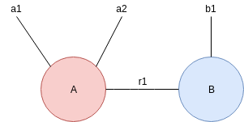

# Tensor Networks

A wrapper framework for building Tensor networks in Tensorflow.
These framework leverages [NetworkX](https://networkx.github.io/) for a simple interface for creating graphs.

## Creating Tensor networks ##

For example, to create a 3-way tensor that is contracted with another 2-way tensor across an auxilliary index **r**
```

tensor_network = Graph("my_tensor_network")

# Two exposed edges for A and one exposed for B
tensor_network.add_node("A", shape=[22, 9], names=["a1", "a2"])
tensor_network.add_node("B", shape=[5], names=["b1"])
tensor_network.add_edge("A", "B", length=10, name="r1")
tensor_network.compile()

```

The resultant graph is as follows:

```
Edge ('A', '') -> {'weight': 22, 'name': 'a1'}
Edge ('A', '') -> {'weight': 9, 'name': 'a2'}
Edge ('A', 'B') -> {'weight': 10, 'name': 'r1'}
Edge ('B', '') -> {'weight': 5, 'name': 'b1'}
Node ('A', {'tfvar': <tf.Variable 'my_tensor_network/A:0' shape=(22, 9, 10) dtype=float32_ref>, 'edge_names': ['a1', 'a2', 'r1']})
Node ('B', {tfvar': <tf.Variable 'my_tensor_network/B:0' shape=(5, 10) dtype=float32_ref>, 'edge_names': ['b1', 'r1']})
```



## Architectures ##

Architectures are then defined in a similar way and are agnostic to the Tensor network for which they reside. 
They describe the topology of the neural network and very similar to [Keras.Sequential](https://keras.io/models/sequential/).

```
class MyArchitecture(IArchitecture):
    def __init__(self):
        num_classes = 10
        network = [
            ConvLayer(shape=[3, 3, 3, 32], strides=[1, 2, 2, 1]),
            ConvLayer(shape=[3, 3, 32, 64]),
            ConvLayer(shape=[3, 3, 64, 128], strides=[1, 2, 2, 1]),
            ConvLayer(shape=[3, 3, 128, 256], strides=[1, 2, 2, 1]),
            ConvLayer(shape=[3, 3, 256, 512], strides=[1, 2, 2, 1]),

            ConvLayer(shape=[3, 3, 512, 1024], strides=[1, 2, 2, 1]),
            ConvLayer(shape=[3, 3, 1024, 1024]),  # 7 x 7 x 512

            # Global average pooling
            AveragePoolingLayer(shape=[1, 7, 7, 1]),

            # Finally a fully connected layer
            Flatten(),
            FullyConnectedLayer(shape=[1024, num_classes])
        ]

        super().__init__(network)


architecture = MyArchitecture()
```

An architecture can then be passed into a tensor network, which defines how the weights are factored.
Note that the ranks will need to be determined a-priori.

```
my_model = TensorNetV1(architecture=architecture, conv_ranks=..., fc_ranks=...)
```

## Citation ##
Please cite if you use this framework.